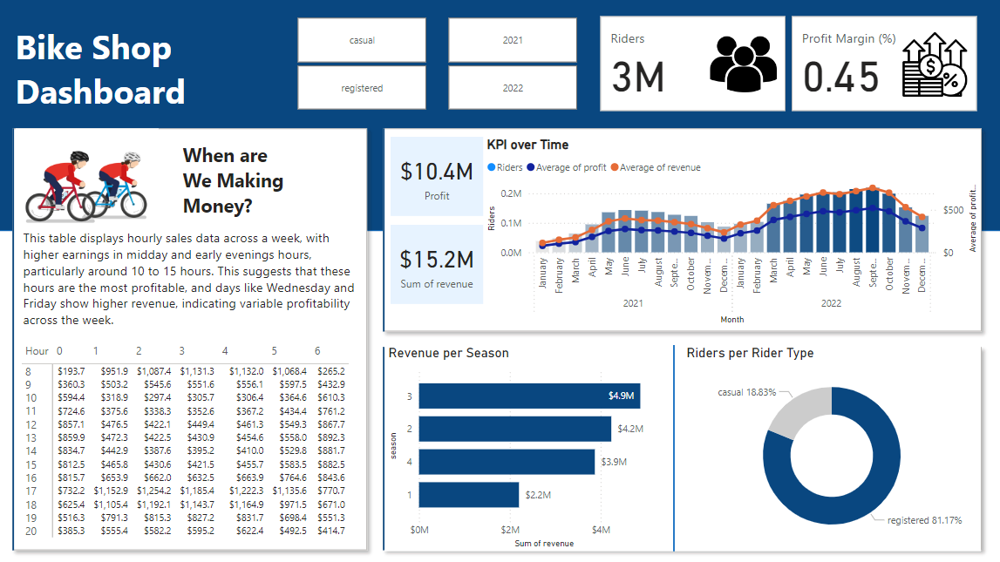

# BikeShopProject

# Objective

* Key objectives for this project

The stakeholders want to me to create an interactive dashboard that contains the key performance indicators for the years 2020 and 2022, such as; revenue, profit, and several others. They will use this dashboard to help them make informed data driven business decisions.

Ideal dashboard
The ideal dashboard should provide the relevant insights into the business, which includes key performance indicators such as;

  * Sum of profit and revenue
  * Profit margin
  * Sum of riders

These KPIs will provide insightful information which the stakeholders can use, but the dashboard should also contain trends and insightful information, such as:

  * Hourly revenue analysis
  * Profit & Revenue trends
  * Seasonal revenue
  * Rider demographics

The stakeholders have also asked my for my recommendation on raising the prices for the year 2023.

# User story
As the manager of this bike shop, I want to identify key performance indicators and trends, this is so we are able to make data driven decisions on whether we should increase the prices of our services in the year 2023.

# Data Source

What data is needed to achieve the objectives?

* Date
* Season
* Weekday
* Hour
* Rider type
* Riders
* Price
* Cost of Goods Sale (COGS)
* Revenue
* Profit

# Stages

The stages for this project will be;
  * Design
  * Development
  * Testing
  * Analysis

What should the dashboard contain?
The dashboard should contain several visualisations, such as:
* Table to show the hourly revenue per weekday
* Profit and Revenue trends per month & year
* Revenue per season
* Doughnut chart of riders per category
* KPIs (Total revenue, total profit, profit margin percentage, total riders)
* Filters for the dashboard (Year, Rider type)

# Development
## Pseudocode
What is the approach you will use to create a solution from start to finish?

1. Get the data
2. Explore and Load the data into SQL
3. Test the data with SQL
4. Visualise the data in Power Bi
5. Generate the findings based on the insights
6. Write the documentation
7. Publish the data to GitHub

# SQL Queries
## UNION the data
```sql
-- UNION the two tables to show 2021 & 2022 data
SELECT *
FROM bike_share_yr_0
UNION					-- Removes any duplicated rows
SELECT *
FROM bike_share_yr_1;
```

## CTE to join the UNION and cost table
```sql
WITH bike_share_data AS (
SELECT *
FROM bike_share_yr_0
UNION
SELECT *
FROM bike_share_yr_1 )

SELECT *
FROM bike_share_data
LEFT JOIN cost_table
	ON bike_share_data.yr = cost_table.yr
```
## Query to get only relevent data for analysis
```sql
/*
	SELECTING the columns that we need for our analysis
	Adding extra fields we need:
		Revenue
		Profits
*/

WITH bike_share_data AS (
	SELECT *
	FROM bike_share_yr_0
	UNION
	SELECT *
	FROM bike_share_yr_1
)

SELECT
	dteday,
	season,
	bike_share_data.yr,
	weekday,
	hr,
	rider_type,
	riders,
	price,
	COGS,
	riders * price AS revenue,
	riders * price - COGS * riders AS profit
FROM bike_share_data
LEFT JOIN cost_table
	ON bike_share_data.yr = cost_table.yr;
```
# Data Validation
I used SQL to calculate the sum of revenue and profit and to validate it was the same figures as seen on the Power Bi dashboard

```sql
WITH bike_share_data AS (
	SELECT *
	FROM bike_share_yr_0
	UNION
	SELECT *
	FROM bike_share_yr_1
)

SELECT
	ROUND(SUM(riders * price),2) AS revenue,
	ROUND(SUM(riders * price - COGS * riders),2) AS profit
FROM bike_share_data
LEFT JOIN cost_table
	ON bike_share_data.yr = cost_table.yr;

```
# Visualisation
## Results
The dashboard looks as below:

